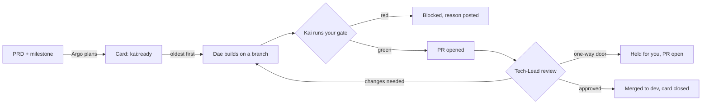

# Kai

**An AI engineering team that works your GitHub board while you sleep, and only merges what it can prove is safe.**

Kai turns a PRD into tickets on a GitHub Projects board, then works through them one by one: a builder agent writes the change, a separate reviewer agent tries to reject it, Kai runs your test suite itself, and only a change that passes all three lands on your staging branch. Anything risky stops and waits for you. You get a Telegram message for every build, merge and escalation, with links.

Queue the cards in the evening. In the morning you have merged, tested, reviewed PRs on `dev`, a board that moved on its own, and a short list of the few things that genuinely need you.

---

## The problem

Coding agents can write the code. The hard part is trusting what they ship.

Teams that adopt Claude Code, Codex or Copilot agents hit the same wall within weeks:

- **The review queue becomes the bottleneck.** Agents open pull requests faster than people can read them.
- **Nobody lets an agent merge.** So every change still waits for a human, and the speed-up disappears.
- **Agents stop only when a person is watching.** Leave one alone and it drifts, over-builds, or tells you the tests pass when it never ran them.
- **The planning is still manual.** Someone has to turn the product doc into small, well-ordered tickets before any agent can start.

The result: agents end up as expensive autocomplete, used in office hours, one prompt at a time.

## What Kai does about it

Kai runs the whole loop, from product doc to merged code, as a background service with guardrails that an agent cannot talk its way past.

| Without Kai | With Kai |
|---|---|
| A human breaks the PRD into tickets | **Argo**, the planner agent, turns the PRD and current milestone into small, dependency-ordered cards with acceptance criteria |
| A human prompts an agent, watches it, reads the diff | **Dae** builds each card on its own branch; **Tech-Lead**, a separate agent, reviews it adversarially |
| "Tests pass," says the agent | Kai runs your gate command itself and ignores the agent's claim |
| Review feedback means another round of prompting | Kai feeds the reviewer's blocking notes back to the builder for a bounded retry |
| Work happens when you are at the keyboard | It runs as a service, polls the board every few minutes and works through the queue overnight |
| Status lives in someone's head | The GitHub Projects board moves itself: In progress, In review, Done |

## How it works



1. **Plan.** Argo reads your PRD from the repo and keeps a set number of cards ready (three by default). It skips anything already open or already shipped, orders cards so nothing depends on unbuilt work, and escalates instead of guessing when the doc is too vague. Run it with `--dry-run` to see proposed cards before any are created.
2. **Pick.** Kai takes the oldest `kai:ready` card, labels it `kai:doing`, moves it to In progress and cuts a fresh branch from your staging branch.
3. **Build.** Dae, a headless Claude Code process, makes the simplest change that meets the acceptance criteria, runs the gate and commits. It does not push, open PRs or merge. If a card is too big or unclear, it says so and stops instead of grinding.
4. **Verify.** Kai runs your gate command itself. Red means nothing is pushed.
5. **Review.** Kai pushes, opens the PR and hands the diff to Tech-Lead, which checks every acceptance criterion, looks for bugs and security issues, and flags hard-to-reverse changes. If it rejects the change, Dae gets the blocking notes and one more try.
6. **Merge or hold.** Kai merges only when **the reviewer approves AND the gate is green AND no one-way door is touched**. It then closes the card, moves it to Done and tells you. Otherwise the card is blocked with the reason posted on it.

## The guardrails

These are enforced in code, not left to the prompts:

- **The builder never merges its own work.** Only the supervisor merges.
- **The reviewer did not write the code.** Separate process, separate prompt, told to find the reason not to ship.
- **Kai never trusts a self-report.** The gate result that counts is the one Kai ran.
- **One-way doors are caught twice.** Kai scans changed paths against your globs and scans only the *added* code for risky keywords, ignoring comments. The reviewer flags them independently. Either one is enough to hold the change. Auth, migrations, payments, secrets, deletions and deploy config are the defaults.
- **Prod is never a merge target.** Kai merges into a staging branch like `dev` and refuses to start if staging and prod are the same branch. Promotion to prod is always yours.
- **Failure means stop, not retry.** An unreadable review is not an approval. A failed merge (conflict, branch protection) is not retried blindly. One bad card never takes down the loop.
- **Every stop leaves a note.** Each blocked or held card gets a comment saying exactly why, and every outcome goes to `state/ledger.jsonl`.

## What you see

On your phone, over Telegram:

```
MERGED to dev: my-app #42
Add weekly summary email

Passed my gate + Tech-Lead review. Card closed.
PR: https://github.com/your-org/my-app/pull/57
Next: nothing needed. Promoting dev to prod (main) stays your manual gate.
```

```
ESCALATION: one-way door on my-app #43
Add password reset flow

This change touches something hard to reverse, so I will NOT merge it on my own.
Trigger: glob:**/auth/**
The PR is OPEN and waiting for your decision.
```

On GitHub: cards moving across your Projects board, PRs with the card linked, and a reason comment on anything that stopped. When the board is empty, Kai sends a quiet heartbeat every six hours so you know it is alive.

## Who it is for

- **Small product teams and solo builders** who want a backlog to move outside working hours without giving an agent the keys.
- **Engineering leads rolling out coding agents** who need a safe default: agents do the routine tickets, humans keep the decisions that matter.
- **Anyone evaluating agentic engineering** who wants to see the full loop (plan, build, verify, review, merge) in about 1,500 lines of readable Python.

## Requirements

- macOS or Linux. Service templates are included for both (launchd and systemd).
- Python 3, standard library only. No packages to install.
- `zsh` (default on macOS; on Linux, `sudo apt install zsh` or equivalent). Kai runs the gate and the agents through a zsh login shell so they see the same PATH you do.
- `git`, the GitHub CLI `gh` (authenticated) and the `claude` CLI on your login PATH.
- A repo with a gate command (for example `pnpm check` or `make test`) and a staging branch.
- Optional: a Telegram bot for notifications, and a GitHub Projects board for status sync.

## Setup

1. Clone this repo, for example to `~/kai-harness`.
2. Copy `kai.project.example.json` to `projects/my-app.project.json` and fill it in. Files in `projects/` are git-ignored.
3. Set up GitHub: the labels, and optionally the Projects board (see [Setting up GitHub](#setting-up-github) below).
4. Optional, for Telegram, create `~/.config/kai-harness/env`:
   ```
   TELEGRAM_BOT_TOKEN=123456:abcdef
   TELEGRAM_CHAT_ID=987654321
   ```
5. Label one small issue `kai:ready` and run a single pass:
   ```zsh
   zsh -lc 'python3 supervisor.py --project projects/my-app.project.json --once'
   ```
6. When a single pass behaves, run it as a service. It restarts itself if it crashes.
   - **macOS:** `./kaictl start` (see `launchd/README.md`).
   - **Linux:** copy `systemd/kai-supervisor.service` to `~/.config/systemd/user/`, edit the path, then `systemctl --user enable --now kai-supervisor`. To keep it running when you log out, run `loginctl enable-linger $USER` once.
7. To let Argo plan, point `planning_sources` at your PRD, try `python3 planner.py --project projects/my-app.project.json --once --dry-run`, then start it as a service when you are happy (`./argoctl start` on macOS, `systemd/kai-planner.service` on Linux). The planner is off by default: card creation stays a human decision until you turn it on.

## Setting up GitHub

### 1. Labels (required)

Labels are how Kai tracks each card. Create them once per repo:

```bash
R=your-org/my-app
gh label create kai:ready   -R $R --color 0E8A16 --description "Ready for Kai to build"
gh label create kai:doing   -R $R --color 1D76DB --description "Kai is building"
gh label create kai:review  -R $R --color FBCA04 --description "PR open, in review"
gh label create kai:blocked -R $R --color D93F0B --description "Stopped, needs a human (reason in comments)"
```

You only ever apply `kai:ready`, by hand or through Argo. Kai moves the card through the rest:

```
kai:ready ──> kai:doing ──> kai:review ──> closed (merged to dev)
                  │              │
                  └──────────────┴──────> kai:blocked (reason posted on the card)
```

To send a blocked card round again, fix the card (or the code), remove `kai:blocked` and add `kai:ready`.

### 2. A card Kai can build

A card is an ordinary GitHub issue. Small and specific wins: one card should be one branch, one PR, about an hour of work. Argo writes cards in this shape, and hand-written ones should follow it:

> **Title:** Add weekly summary email
>
> Users who opted in to summaries get a Monday email with last week's activity, so they come back without us sending generic newsletters.
>
> **Acceptance criteria:**
> - A `sendWeeklySummary(userId)` job builds the email from the last 7 days of activity
> - Users with `summaryOptIn = false` are skipped
> - The email uses the existing `BaseEmail` template
> - Unit tests cover opted-in, opted-out and no-activity users
>
> **Scope:** ~4 files. Cite: `CONVENTIONS.md` (email templates), `docs/prd.md` section 3.2.
> **Halt-and-ask if:** it needs a new email provider or a new secret.

The acceptance criteria matter most: the builder builds to them and the reviewer checks against them. If you cannot write them, the card is too big; split it.

### 3. Projects board (optional)

If you use a GitHub Projects board, Kai moves each card's Status as it works. Without it, everything still works through labels.

**What the board should look like:** a Board view grouped by the built-in **Status** field, with at least these four options (the default board template has three; add **In Review**):

| Status column | Who puts the card there |
|---|---|
| Todo | You or Argo (with the `kai:ready` label) |
| In Progress | Kai, when Dae starts building |
| In Review | Kai, when the PR is open and under review |
| Done | Kai, after merging |

Blocked cards stay where they stopped and carry the `kai:blocked` label, so filter or group by label to see them.

**Setup:**

1. In the project's **Workflows**, turn on **Auto-add to project** for your repo (for example with filter `is:issue`), so new cards land on the board. Kai only moves cards that are already on it.
2. Give `gh` access to projects: `gh auth refresh -s project`.
3. Look up the IDs Kai needs:
   ```bash
   gh project list --owner your-org                                    # the project number
   gh project view 1 --owner your-org --format json --jq .id           # project_id (PVT_...)
   gh project field-list 1 --owner your-org --format json \
     --jq '.fields[] | select(.name=="Status") | {id, options}'        # status_field_id and option ids
   ```
4. Put them in the `project_board` block of your project file:
   ```json
   "project_board": {
     "owner": "your-org",
     "project_number": 1,
     "project_id": "PVT_kwDO...",
     "status_field_id": "PVTSSF_lADO...",
     "status_options": { "in_progress": "47fc9ee4", "in_review": "df73e18b", "done": "98236657" }
   }
   ```

Board sync is best-effort by design: if the board is misconfigured, Kai logs it and carries on building. A cosmetic failure never blocks a merge.

## Configuration

| Key | What it does |
|-----|--------------|
| `repo_dir`, `github_repo` | Where the code lives locally and on GitHub |
| `prod_branch`, `merge_target` | Kai merges into `merge_target` only, never `prod_branch` |
| `gate_cmd` | The command that must pass before anything is pushed or merged |
| `one_way_door_globs`, `one_way_door_keywords` | Paths and added-code keywords that force a human decision |
| `conventions_path` | Your repo's engineering rules, passed to every agent |
| `max_fix_attempts` | How many times Dae may retry after review feedback (default 1) |
| `labels` | The four board labels, if you want different names |
| `planning_sources`, `current_milestone`, `planner_target_ready` | What Argo plans from, which milestone, and how many ready cards to keep queued |
| `project_board` | Optional: keeps a GitHub Projects Status column in sync |

## Layout

```
supervisor.py        Kai: branch, build, gate, review, merge or hold
planner.py           Argo: stocks the board from your PRD (never writes code, never merges)
lib.py               gh, git, gate, Telegram and claude wrappers, one-way-door detection
agents/              the Markdown prompts for Dae, Tech-Lead and Argo
kaictl, argoctl      start, stop, status and logs for the two services (macOS)
launchd/             macOS service templates and install notes
systemd/             Linux service templates
tests/               unit tests for the decision logic
```

Run the tests with `python3 -m unittest discover -s tests`.

## Status

Built and run against a real Next.js product repo on macOS, planning from its PRD and merging to its staging branch. On Linux the supervisor loop is verified; the full build path uses the same code but has had less mileage there. It is a working harness, not a packaged product: expect to read the code and adapt the prompts, rules and config to your repo. Inbound Telegram messages are logged but not yet acted on; approving escalations from your phone is the next increment.

## Adopting this on your team

The code is the easy part. What makes it work is well-sized tickets, a gate you trust, and one-way-door rules that match your system. If you want help setting that up on your repo, or running agents like this across a team, get in touch via [irfan.build](https://irfan.build).

## License

MIT. See `LICENSE`.
